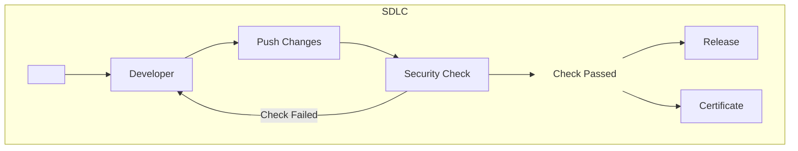

# 🚧 Repository Under Construction 🚧

This repository is currently under active development. Features and documentation may change frequently. Please check back later for updates!

# Ready-To-Go Healthcare CI Pipelines

  

This project is an open-source collection of Continuous Integration (CI) pipelines designed to streamline the development of secure and compliant healthcare software. The project provides CI pipeline configurations that enforce current security best practices and compliance standards. Our goal is to enable rapid integration, testing, and delivery of software that meets stringent regulatory requirements while actually improving the security of the software stack.

## Salient Features

- **Drop-In Pipelines**: Ready-to-use workflows for common healthcare software scenarios.
- **Compliance as Code**: Ensures that every build adheres to predefined regulatory standards.
- **Security Checks**: Integrates security scanning tools to detect vulnerabilities early.
- **Automated Testing**: Supports unit, integration, and end-to-end testing.
- **Documentation Generation**: Automatically generates compliance reports in various formats.
- **Notification System**: Alerts for build status, security vulnerabilities, and compliance deviations.
- **Free**: All pipelines are based on freely available tools up to certain usage thresholds.

## Integration

All pipelines within this repo implement standalone security checks that pass/fail and generate reports. The generic integration pattern looks as follows:

Integration within your project's CI system may differ depending on the platform and code development flow you use.

## List of Security Checks

[FDA pre-market cybersecurity guidelines](https://www.fda.gov/regulatory-information/search-fda-guidance-documents/cybersecurity-medical-devices-quality-system-considerations-and-content-premarket-submissions) for submission include vulnerability scanning as a requirement. Specifically, the categories:

1. Abuse or misuse cases, malformed and unexpected inputs; Robustness and Fuzz testing.
2. Attack surface analysis;
3. Vulnerability chaining;
4. Closed box testing of known vulnerability scanning;
5. Software composition analysis of binary executable files; and
6. Static and dynamic code analysis, including testing for credentials that are "hardcoded," default, easily guessed, and easily compromised.

In this repository we provide example pipelines that cover multiple categories above, including:

1. Software Composition Analysis (SCA) - Static scan, known vulnerability testing.
2. API Testing - Dynamic analysis, unknown vulnerability detection, robustness and fuzz testing.

## Pipeline Templates

Table of templates:

| Scan / CI   | Github Actions     | Bitbucket Pipelines | Gitlab CI |
|-------------|--------------------|---------------------|-----------|
| SCA         | :white_check_mark: | :white_check_mark:  |           |
| API Testing | :white_check_mark: | :white_check_mark:  |           |

## Support

For support, email `labs@mayhem.security` or open an issue in the GitHub repository.

## Contributing

We welcome contributions from the community! Please read [CONTRIBUTING.md](CONTRIBUTING.md) for details on our code of conduct, and the process for submitting pull requests to us.

## License

This project is licensed under the MIT License - see the [LICENSE.md](LICENSE.md) file for details.
