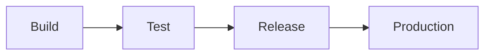
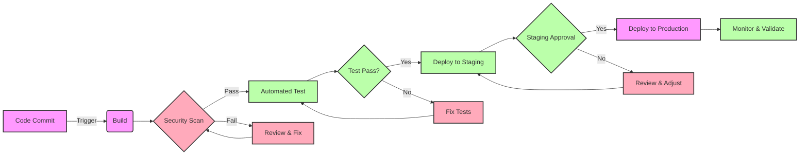

# Healthcare CI Pipelines

## Overview

This project is an open-source collection of Continuous Integration (CI) pipelines designed to streamline the development of secure and compliant healthcare software. This project provides CI pipeline configurations that automatically enforce security best practices and compliance standards pertinent to the healthcare industry. Our goal is to enable rapid integration, testing, and delivery of software that meets stringent regulatory requirements.

## Features

- **Pre-configured Pipelines**: Ready-to-use workflows for common healthcare software scenarios.
- **Compliance as Code**: Ensures that every build adheres to predefined regulatory standards.
- **Security Checks**: Integrates security scanning tools to detect vulnerabilities early.
- **Automated Testing**: Supports unit, integration, and end-to-end testing.
- **Documentation Generation**: Automatically generates compliance and technical documentation.
- **Notification System**: Alerts for build status, security vulnerabilities, and compliance deviations.

## Getting Started

These instructions will get you a copy of the project up and running on your local machine for development and testing purposes.

### Prerequisites

```bash
git clone https://github.com/yourusername/healthcare-ci-pipeline.git
cd healthcare-ci-pipeline
```

## Integration

Integration within your project's CI system may differ depending on the platform and code development flow you use. All pipelines within this repo follow the structure below and should be straightforward to repurpose for your needs:






## Support

For support, email `labs@forallsecure.com` or open an issue in the GitHub repository.

## License

This project is licensed under the MIT License - see the [LICENSE.md](LICENSE.md) file for details.

## Contributing

We welcome contributions from the community! Please read [CONTRIBUTING.md](CONTRIBUTING.md) for details on our code of conduct, and the process for submitting pull requests to us.

## Acknowledgments

- Thanks to all the contributors who have helped shape this project.
- Special thanks to healthcare professionals who provided insights into compliance needs.
