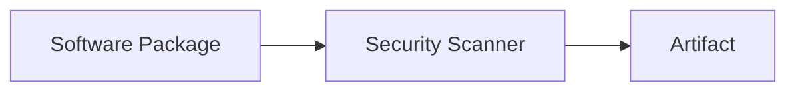
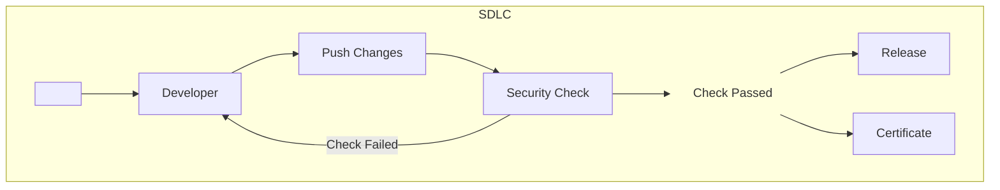

# Ready-To-Go Healthcare CI Pipelines

An open-source collection of Continuous Integration (CI) pipelines designed to
streamline the development of secure and compliant healthcare software.
The project comes with CI pipeline configurations that enforce current security best
practices and compliance standards. Our goal is to enable rapid integration, testing,
and delivery of software that meets stringent regulatory requirements while actually
improving the security of the software stack.

## Features

- **Drop-In Pipelines**: Ready-to-use workflows for standard scenarios.
- **Extended Support**: Support for several CI providers. Yours missing? Open an issue!
- **Compliance as Code**: Build passes? Regulatory standard is met!
- **Artifact Generation**: Generate compliance reports in standard formats.
- **Free**: All pipelines are based on freely available tools up to certain usage thresholds.

## Pipeline Templates

| Scan / CI    |   | Github Actions     | Gitlab CI    | Bitbucket Pipelines |
|--------------|---|--------------------|--------------|---------------------|
| SBOM/SCA     |   | [GO](https://github.com/forallsecure/healthcare-ci-pipelines/tree/main/pipelines/github/sbom) $\checkmark$ | [GO](https://github.com/forallsecure/healthcare-ci-pipelines/tree/main/pipelines/gitlab/sbom) $\checkmark$ | [GO](https://github.com/forallsecure/healthcare-ci-pipelines/tree/main/pipelines/bitbucket/sbom) $\checkmark$ |
| API Testing  |   | [GO](https://github.com/forallsecure/healthcare-ci-pipelines/tree/main/pipelines/github/api) $\checkmark$  | [GO](https://github.com/forallsecure/healthcare-ci-pipelines/tree/main/pipelines/gitlab/api)  $\checkmark$ | [GO](https://github.com/forallsecure/healthcare-ci-pipelines/tree/main/pipelines/bitbucket/api)  $\checkmark$ |
| Fuzz Testing |   | [GO](https://github.com/forallsecure/healthcare-ci-pipelines/tree/main/pipelines/github/fuzz) $\checkmark$ | [GO](https://github.com/forallsecure/healthcare-ci-pipelines/tree/main/pipelines/gitlab/fuzz) $\checkmark$ | [GO](https://github.com/forallsecure/healthcare-ci-pipelines/tree/main/pipelines/bitbucket/fuzz) $\checkmark$ |

## Artifacts

All pipelines in this repository generate artifacts in standardized formats.
The general architecture for all our integrations is of the form:

```mermaid
flowchart LR
  Package[Software Package]
  Scanner[Security Scanner]
  Artifact[Artifact]
  Package --> Scanner --> Artifact
```

All pipelines implement standalone security checks that pass/fail and generate
reports. The generic integration pattern is as follows:

```mermaid
flowchart TB
  Develop[Developer]
  Commit[Push Changes]
  Test[Security Check]
  Report[Certificate]
  Release[Release]
  Pass[Check Passed]
  subgraph SDLC
    start[ ] --> Develop
    Develop --> Commit
    Commit --> Test
    Test --> Pass
    Pass --> Release
    Pass --> Report
  end
  Test -->| Check Failed |Develop

  classDef empty fill:none,stroke-width:0px
  class Pass empty

```

Integration within your project's CI system may differ depending on the platform and code development flow you use.

## List of Security Checks

[FDA pre-market cybersecurity guidelines](https://www.fda.gov/regulatory-information/search-fda-guidance-documents/cybersecurity-medical-devices-quality-system-considerations-and-content-premarket-submissions) for submission include vulnerability scanning as a requirement. Specifically, the categories:

1. Abuse or misuse cases, malformed and unexpected inputs; Robustness and Fuzz testing.
2. Attack surface analysis;
3. Vulnerability chaining;
4. Closed box testing of known vulnerability scanning;
5. Software composition analysis of binary executable files; and
6. Static and dynamic code analysis, including testing for credentials that are "hardcoded," default, easily guessed, and easily compromised.

In this repository we provide example pipelines that cover multiple categories above, including:

1. Software Composition Analysis (SCA) - Static scan, known vulnerability testing.
2. API Testing - Dynamic analysis, unknown vulnerability detection, robustness and fuzz testing.

## Contributing

We welcome contributions from the community! Please read
[our contribution guide](https://github.com/forallsecure/healthcare-ci-pipelines/tree/main/CONTRIBUTING.md) and submit pull requests to us.

## License

This project is licensed under the MIT License - see the [LICENSE](https://github.com/forallsecure/healthcare-ci-pipelines/tree/main/LICENSE.md) for details.
