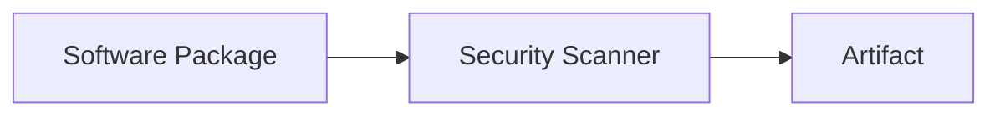
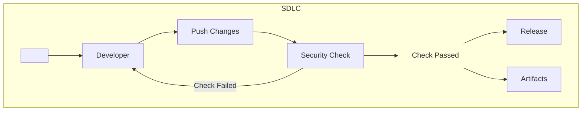

# Ready-To-Go Healthcare CI Pipelines

An open-source collection of Continuous Integration (CI) pipelines designed to
streamline the development of secure and compliant healthcare software.
The project comes with CI pipeline configurations that enforce current security best
practices and compliance standards. Our goal is to enable rapid integration, testing,
and delivery of software that meets stringent regulatory requirements while actually
improving the security of the software stack.

## Features

- **Drop-In Pipelines**: Ready-to-use workflows for standard scenarios.
- **Extended Support**: Support for several CI providers. Yours missing? Open an issue!
- **Compliance as Code**: Build passes? Regulatory standard is met!
- **Artifact Generation**: Generate compliance reports in standard formats.
- **Free**: All pipelines are based on freely available tools up to certain usage thresholds.

## Pipeline Templates

| Scan / CI    |   | Github Actions     | Gitlab CI    | Bitbucket Pipelines |
|--------------|---|--------------------|--------------|---------------------|
| SBOM/SCA     |   | [GO](https://github.com/forallsecure/healthcare-ci-pipelines/tree/main/pipelines/github/sbom) $\checkmark$ | [GO](https://github.com/forallsecure/healthcare-ci-pipelines/tree/main/pipelines/gitlab/sbom) $\checkmark$ | [GO](https://github.com/forallsecure/healthcare-ci-pipelines/tree/main/pipelines/bitbucket/sbom) $\checkmark$ |
| API Testing  |   | [GO](https://github.com/forallsecure/healthcare-ci-pipelines/tree/main/pipelines/github/api) $\checkmark$  | [GO](https://github.com/forallsecure/healthcare-ci-pipelines/tree/main/pipelines/gitlab/api)  $\checkmark$ | [GO](https://github.com/forallsecure/healthcare-ci-pipelines/tree/main/pipelines/bitbucket/api)  $\checkmark$ |
| Fuzz Testing |   | [GO](https://github.com/forallsecure/healthcare-ci-pipelines/tree/main/pipelines/github/fuzz) $\checkmark$ | [GO](https://github.com/forallsecure/healthcare-ci-pipelines/tree/main/pipelines/gitlab/fuzz) $\checkmark$ | [GO](https://github.com/forallsecure/healthcare-ci-pipelines/tree/main/pipelines/bitbucket/fuzz) $\checkmark$ |

## Architecture

All pipelines in this repository generate artifacts in standardized [formats](#artifact-formats).
The general architecture for all pipelines is of the form:

```mermaid
flowchart LR
  Package[Software Package]
  Scanner[Security Scanner]
  Artifact[Artifact]
  Package --> Scanner --> Artifact
```

## Artifact Formats

We typically produce artifacts in two main formats: SPDX and SARIF
(unless unsupported by the security check used).

**Software Package Data Exchange (SPDX)**. SPDX is an open standard for communicating SBOM information,
including components, licenses, copyright, and security references. It is part part of the Linux
Foundation’s [Open Compliance Program](https://compliance.linuxfoundation.org) and is an official
ISO-approved standard ([SPDX specification documentation](https://spdx.dev)).
[SPDX 2.3](https://spdx.github.io/spdx-spec/v2.3/) is currently the latest ISO approved version
that is widely supported by tooling in the community (version 3 was released in 2024 and once it
becomes more popular we will upgrade this repo as well). SCM systems like GitHub support it as
a native SBOM format.

**Static Analysis Results Interchange Format (SARIF)**. SARIF is a standard, JSON-based format for the
output of [static analysis tools](https://github.com/microsoft/sarif-tutorials/blob/main/docs/Glossary.md#static-analysis-tool)
(though it has been extended recently to support any system analysis results).
It has been [approved](https://www.oasis-open.org/news/announcements/static-analysis-results-interchange-format-sarif-v2-1-0-is-approved-as-an-oasis-s)
as an [OASIS standard](https://www.oasis-open.org/). It is supported as a native format for communicating
security vulnerabilities to SCM platforms like Github. SARIF has significant [ecosystem and tooling support](https://sarif.info/)
and is being used as the standard for capturing and aggregating vulnerabilities in other safety-critical
industries such as [automotive](https://github.com/nutonomy/AVCDL/).

## List of Security Checks

Our pipelines currently cover three categories of security checks:

1. Software Bill of Materials (SBOM) / Software Composition Analysis (SCA) Scanning.
   We use SBOM/SCA pipelines for scanning software packages and identifying known
   vulnerabilities.
2. API Security Testing (AST). Dynamic analysis for unknown vulnerability detection,
   robustness checking and fuzz testing of APIs.
3. Code Fuzz Testing (CFT). Dynamic analysis for unknown vulnerability detection,
   robustness checking and coverage-guided fuzz testing of code.

The selection above is not random, they categories above implement pipelines to meet
[FDA pre-market cybersecurity guidelines](https://www.fda.gov/regulatory-information/search-fda-guidance-documents/cybersecurity-medical-devices-quality-system-considerations-and-content-premarket-submissions)
for submissions that have vulnerability scanning as a requirement. Specifically, we cover the categories:

1. Abuse or misuse cases, malformed and unexpected inputs; Robustness and Fuzz testing. (AST/CFT)
2. Attack surface analysis; (SBOM/SCA)
3. Closed box testing of known vulnerability scanning; (SBOM/SCA)
4. Software composition analysis of binary executable files; and (SBOM/SCA)
5. Static and dynamic code analysis, including testing for credentials that are "hardcoded," default, easily guessed, and easily compromised. (AST/CFT)

Clean artifacts from the scanning pipelines above can be used as evidence for a team's FDA submission.

## Integration

Security checks can be automatically configured to pass/fail the pipeline and
depending on the outcome move the software to release or not. An example integration
within the Software Development Life Cycle (SDLC) follows:

```mermaid
flowchart TB
  Develop[Developer]
  Commit[Push Changes]
  Test[Security Check]
  Report[Artifacts]
  Release[Release]
  Pass[Check Passed]
  subgraph SDLC
    start[ ] --> Develop
    Develop --> Commit
    Commit --> Test
    Test --> Pass
    Pass --> Release
    Pass --> Report
  end
  Test -->| Check Failed |Develop

  classDef empty fill:none,stroke-width:0px
  class Pass empty

```

Integration within your team's SDLC may differ depending on the platform and flow you use.
Artifacts can be used as evidence of all security checks your software package passed.

## Contributing

We welcome contributions from the community! Please read
[our contribution guide](https://github.com/forallsecure/healthcare-ci-pipelines/tree/main/CONTRIBUTING.md) and submit pull requests to us.

## License

This project is licensed under the MIT License - see the [LICENSE](https://github.com/forallsecure/healthcare-ci-pipelines/tree/main/LICENSE.md) for details.
